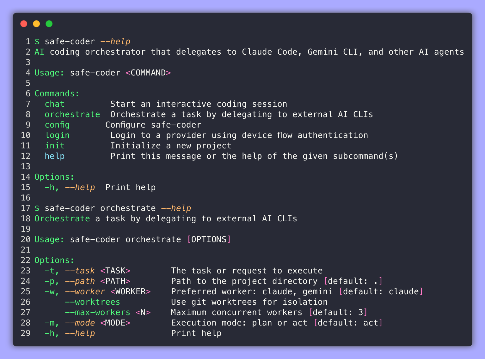

# Safe Coder

A powerful **AI coding CLI** and **multi-agent orchestrator** built in Rust. Safe Coder works as a standalone coding assistant with full tool capabilities, and can also delegate complex tasks to specialized AI CLI agents (Claude Code, Gemini CLI) running in isolated git workspaces.



## 🌟 What's New

### 🧠 **LSP Integration (v2.3)**
- **Language Server Protocol support** - Get IDE-like features directly in the terminal
- **Automatic LSP downloads** - Automatically install and configure language servers
- **Real-time code intelligence** - Syntax highlighting, error detection, and code completion
- **Multi-language support** - Works with Rust, TypeScript, Python, Go, and more
- **Shell-integrated LSP** - Access language features seamlessly in the TUI

### 🚀 **Orchestration Integration (v2.2)**
- **Shell-integrated orchestration** - Run `@orchestrate <task>` directly from the shell TUI
- **GitHub Copilot support** - New worker type using `gh copilot` for task execution
- **Worker distribution strategies** - Single, round-robin, task-based, or load-balanced task distribution
- **Self-orchestration** - Safe-Coder can now use itself as a worker for recursive delegation
- **Plan vs Act modes** - Choose between approval-required planning or auto-execution

### 🧠 **Smarter AI (v2.1)**
- **Context-aware reasoning** - AI understands project structure and conventions
- **Loop detection** - Prevents AI from getting stuck in repetitive patterns
- **Inline bash streaming** - See command output in real-time as it executes
- **Better word wrapping** - Improved text rendering in the TUI

### 🛠️ **Expanded Tool Suite**
- **Glob search** - Fast file pattern matching with `**/*.rs` syntax
- **Grep search** - Content search across files with regex support
- **File listing** - Directory exploration with smart filtering
- **Todo tracking** - Built-in task management for complex workflows
- **Web fetch** - Retrieve and analyze web content

### 📁 **File Picker UI**
- **Visual file selection** - Browse and select files with a popup interface
- **Keyboard navigation** - Use arrow keys to navigate directories
- **Glob pattern support** - Filter files with patterns like `*.ts`

### 🔐 **Permission Modes**
- **Plan mode** - Preview all actions before execution
- **Default mode** - Ask before each tool call (recommended)
- **Auto-edit mode** - Auto-approve file operations only
- **YOLO mode** - Auto-approve everything (use with caution)

### ⚡ **Simplified Architecture (v2.0)**
- **20x faster startup** - Removed VM/Docker complexity for direct filesystem access
- **Git-based safety** - All changes tracked with automatic commits and easy rollback
- **Cross-platform** - Works seamlessly on Linux, macOS, and Windows
- **1,200+ lines removed** - Cleaner codebase focused on core features

### 🦙 **Local AI Support (Ollama)**
- **100% Private** - Run completely locally with no API costs
- **Offline capable** - Works without internet connection
- **Multiple models** - DeepSeek Coder, Qwen Coder, CodeLlama, and more
- **GPU acceleration** - Automatic NVIDIA/Apple Silicon support

### 🎨 **Enhanced TUI Experience**
- **OpenCode-inspired theme** - Modern VS Code-style interface design
- **Dynamic ASCII banner** with neon gradient effects
- **Cyberpunk theme** - Pulsing neon borders and glitch effects
- **Professional dark mode** - Google CLI / Claude Code inspired styling
- **Animated processing** - Braille spinners and real-time status updates
- **Inline reasoning display** - See AI thought process between tool calls

### ⚡ **Qwen Code CLI Features**
- **Slash commands** (`/help`, `/stats`, `/chat save`) for meta-control
- **At-commands** (`@file.rs`) for context attachment with glob patterns
- **Shell passthrough** (`!cargo test`) for direct command execution
- **Session management** - Save, resume, and delete conversations
- **Approval modes** - Fine-grained control over AI tool execution
- **Custom commands** - User-defined shortcuts for frequent operations

## Features

### 🧠 **Language Server Protocol (LSP) Features**
- **Automatic Setup**: Download and configure language servers automatically
- **Code Intelligence**: Real-time syntax highlighting, error detection, and diagnostics
- **Multi-Language**: Support for Rust, TypeScript, Python, Go, Java, C++, and more
- **Shell Integration**: Access LSP features directly from the terminal interface
- **Smart Completions**: Context-aware code completion suggestions
- **Error Highlighting**: Real-time error detection and inline diagnostics

### 🖥️ **Interactive Shell Mode (Modern TUI)**
- **Command Block Interface**: Warp-like shell with visual command blocks and streaming output
- **AI Integration**: Use `@connect` and `@ <query>` for context-aware AI assistance
- **Real-time Tool Display**: Watch AI tool calls execute live with progress indicators
- **Diff Rendering**: File edits show compact diffs with +/- indicators for changes
- **Smart Autocomplete**: Tab completion for commands and file paths with popup UI
- **Scrolling Support**: Mouse scroll wheel and keyboard navigation
- **Context-Aware AI**: Automatically includes shell context (commands + outputs)
- **Git Safety**: Auto-commit disabled in shell mode to prevent unwanted changes

### 💻 **Standalone Coding CLI**
- **Direct AI Coding**: Full-featured coding assistant without external dependencies
- **Comprehensive Tool Suite**: Read, write, edit, glob, grep, list, todo, and web fetch
- **Multiple LLM Providers**: Claude, OpenAI, or Ollama (local models)
- **Privacy-First Option**: Run 100% locally with Ollama - no API costs, complete privacy
- **Beautiful TUI**: Modern terminal interface with professional styling and animations
- **File Picker**: Visual file selection with keyboard navigation and glob patterns

### ⚡ **Qwen Code CLI-Inspired Features**
- **Slash Commands**: Meta-level control with `/help`, `/stats`, `/chat save/resume/list`
- **At-Commands**: File context attachment with `@main.rs` or `@src/**/*.rs` (supports globs)
- **Shell Passthrough**: Direct command execution with `!cargo test`, `!git status`
- **Session Management**: Save conversations, resume later, track history
- **Memory System**: Project context via `.safe-coder/SAFE_CODER.md` file
- **Approval Modes**: Control AI execution (plan/default/auto-edit/yolo)
- **Custom Commands**: Create user-defined shortcuts for frequent operations
- **Statistics Tracking**: Monitor token usage, tool calls, session metrics

### 🎯 **Orchestrator Mode**
- **Multi-Agent Delegation**: Orchestrate Claude Code, Gemini CLI, GitHub Copilot, and Safe-Coder itself
- **Task Planning**: Automatically break down complex requests into manageable tasks
- **Workspace Isolation**: Each task runs in its own git worktree/branch
- **Parallel Execution**: Run up to 3 AI agents concurrently with intelligent throttling
- **Throttle Control**: Per-worker-type concurrency limits and start delays to respect rate limits
- **Worker Strategies**: Single-worker, round-robin, task-based, or load-balanced distribution
- **Automatic Merging**: Merge completed work back to main branch

### 🔒 **Git-Based Safety (Simplified Architecture)**
- **Direct Filesystem Access**: 20x faster than VM isolation while maintaining safety
- **Automatic Git Tracking**: Every change gets auto-committed with descriptive messages
- **Easy Rollback**: Use `/restore` or git commands to undo any changes
- **Change Transparency**: Review all modifications with standard Git tools
- **Approval Controls**: Multiple modes to control what AI can execute automatically

### 🎨 **Beautiful Interface**
- **Modern TUI Design**: Professional dark theme inspired by Google CLI and Claude Code
- **Dynamic ASCII Banner**: Large gradient banner with project context
- **Animated Processing**: Smooth braille spinners and real-time status updates
- **Cyberpunk Theme Option**: Neon colors with pulsing borders and glitch effects
- **Multi-Panel Layout**: Conversation, status, and tool execution panels
- **Real-time Updates**: Live monitoring of all operations and system status

## Architecture

Safe Coder now uses a simplified, high-performance architecture focused on **Git-based safety** instead of complex VM isolation:

```
┌─────────────────────────────────────────┐
│          Safe Coder CLI                 │
│  ┌───────────┐      ┌──────────────┐   │
│  │    LLM    │◄────►│ Tool Engine  │   │
│  │  Client   │      │ Read/Write/  │   │
│  │ (Claude/  │      │ Edit/Bash    │   │
│  │  OpenAI/  │      └──────┬───────┘   │
│  │  Ollama)  │             │           │
│  └───────────┘             │           │
│                            ▼           │
│  ┌─────────────────────────────────┐   │
│  │     Git Safety Manager          │   │
│  │  - Auto-commit after changes    │   │
│  │  - Snapshot before operations   │   │
│  │  - Easy rollback with /restore  │   │
│  │  - Change tracking & transparency  │   │
│  └─────────────────────────────────┘   │
└─────────────────────────────────────────┘
                  │
                  ▼
        ┌──────────────────┐
        │  Project Files   │
        │  (Direct Access) │
        │  + Git Tracking  │
        └──────────────────┘
```

### Benefits of Simplified Architecture
- ⚡ **20x faster startup** (no VM overhead)
- ⚡ **10x faster tool execution** (direct filesystem access)
- 📉 **1,200+ lines removed** (simpler codebase)
- ✅ **Cross-platform compatibility** (works everywhere Git does)
- 🔧 **Better IDE integration** (file watchers, language servers work)
- 🎯 **Industry-standard safety** (Git-based rollback)

### Multi-Agent Orchestration

For complex tasks, Safe Coder can still orchestrate multiple AI agents:

```
┌─────────────────────────────────────────────────────────────────┐
│                    Safe Coder Orchestrator                       │
│                                                                  │
│  ┌──────────────┐    ┌──────────────────────────────────────┐   │
│  │   Planner    │───►│         Task Queue                   │   │
│  │  (Decompose  │    │  ┌────────┐ ┌────────┐ ┌────────┐   │   │
│  │   requests)  │    │  │ Task 1 │ │ Task 2 │ │ Task 3 │   │   │
│  └──────────────┘    │  └────────┘ └────────┘ └────────┘   │   │
│                      └──────────────────────────────────────┘   │
│                                    │                             │
│         ┌──────────────────────────┼─────────────────────┐      │
│         ▼                          ▼                     ▼      │
│  ┌─────────────┐           ┌─────────────┐        ┌──────────┐ │
│  │ Git Worktree│           │ Git Worktree│        │Git Branch│ │
│  │   Worker 1  │           │   Worker 2  │        │ Worker 3 │ │
│  │ (Claude Code)│          │ (Gemini CLI)│        │(Claude)  │ │
│  └──────┬──────┘           └──────┬──────┘        └────┬─────┘ │
│         │                         │                     │       │
│         └────────────────────┬────┴────────────────────┘       │
│                              ▼                                   │
│                    ┌──────────────────┐                         │
│                    │   Merge Results  │                         │
│                    │  (git merge)     │                         │
│                    └──────────────────┘                         │
└─────────────────────────────────────────────────────────────────┘
```

## Quick Start

### Prerequisites

1. **Git**: Required for change tracking and safety (usually pre-installed)

2. **API Key or Local Setup**: Choose one option:
   - **Anthropic API key** for Claude models
   - **OpenAI API key** for GPT models  
   - **Ollama** for local, private AI (see [Local AI Setup](#local-ai-with-ollama))

3. **For Orchestrator Mode** (optional):
   - [Claude Code](https://docs.anthropic.com/en/docs/claude-code): `npm install -g @anthropic-ai/claude-code`
   - [Gemini CLI](https://github.com/google/gemini-cli): Install from official repository
   - [GitHub Copilot](https://cli.github.com/): `gh extension install github/gh-copilot`

### Installation

#### From GitHub Releases (Recommended)

Download the latest release for your platform from the [Releases page](https://github.com/siddharth-ghatti/Safe-Coder/releases).

**Linux / macOS:**
```bash
# Download the binary for your platform (choose one)

# For Linux x86_64:
curl -LO https://github.com/siddharth-ghatti/Safe-Coder/releases/latest/download/safe-coder-linux-x86_64
chmod +x safe-coder-linux-x86_64
sudo mv safe-coder-linux-x86_64 /usr/local/bin/safe-coder

# For macOS Intel:
curl -LO https://github.com/siddharth-ghatti/Safe-Coder/releases/latest/download/safe-coder-macos-x86_64
chmod +x safe-coder-macos-x86_64
sudo mv safe-coder-macos-x86_64 /usr/local/bin/safe-coder

# For macOS Apple Silicon (M1/M2/M3):
curl -LO https://github.com/siddharth-ghatti/Safe-Coder/releases/latest/download/safe-coder-macos-aarch64
chmod +x safe-coder-macos-aarch64
sudo mv safe-coder-macos-aarch64 /usr/local/bin/safe-coder
```

**Windows:**
Download `safe-coder-windows-x86_64.exe` from the releases page and either run it directly or add it to your PATH.

#### From Source

```bash
# Clone the repository
git clone https://github.com/siddharth-ghatti/Safe-Coder.git
cd Safe-Coder

# Build the project
cargo build --release

# Install the binary
sudo cp target/release/safe-coder /usr/local/bin/
```

## Usage

Safe Coder offers multiple modes to fit your workflow:

### Shell Mode (Interactive Terminal)

Start the modern shell with command blocks and AI integration:

```bash
# Start the shell TUI (default)
safe-coder shell

# Start shell in a specific directory
safe-coder shell --path /path/to/project

# Use legacy text-based shell (no TUI)
safe-coder shell --no-tui
```

**Shell TUI Features:**
- **Command Blocks**: Each command gets its own visual block with bordered output
- **Real-time Streaming**: See command output as it happens
- **AI Tool Execution**: Watch AI tools execute live with diff previews
- **Smart Autocomplete**: Tab completion for commands and file paths
- **Context-Aware AI**: Shell history automatically included in AI queries

**AI Commands in Shell:**

| Command | Description |
|---------|-------------|
| `@connect` | Connect to AI for coding assistance |
| `@ <question>` | Ask AI for help (includes shell context automatically) |
| `@orchestrate <task>` | Delegate task to background AI agents |

**Navigation & Controls:**

| Key | Action |
|-----|--------|
| `Tab` | Cycle through autocomplete suggestions |
| `Shift+Tab` | Cycle backwards through suggestions |
| `Enter` or `→` | Apply selected autocomplete suggestion |
| `Shift+↑/↓` | Scroll through command history |
| `Mouse Wheel` | Scroll up/down through output |
| `PageUp/PageDown` | Fast scroll through output |
| `↑/↓` | Navigate command history |
| `^C` | Exit the shell |

### Chat Mode (Direct AI Coding)

Start an AI coding session with full tool capabilities:

```bash
# Start TUI chat session
safe-coder chat

# Start in specific directory
safe-coder chat --path /path/to/project

# Classic CLI mode (no TUI)
safe-coder chat --tui false

# Use plan mode (preview tools before execution)
safe-coder chat --mode plan

# Demo mode (showcases all TUI features)
safe-coder chat --demo
```

**Advanced Chat Features:**

| Command Type | Example | Description |
|--------------|---------|-------------|
| **Slash Commands** | `/help`, `/stats`, `/chat save` | Meta-level control |
| **At-Commands** | `@main.rs`, `@src/**/*.rs` | Attach file context |
| **Shell Commands** | `!cargo test`, `!git status` | Execute shell commands |
| **Custom Commands** | `/test`, `/refactor <fn>` | User-defined shortcuts |

**Approval Modes:**
- `plan` - Show execution plan, ask for approval
- `default` - Ask before each tool (recommended)
- `auto-edit` - Auto-approve file operations only  
- `yolo` - Auto-approve everything (use with caution)

### Orchestrate Mode (Multi-Agent)

Delegate complex tasks to multiple AI agents working in parallel:

```bash
# Interactive orchestration
cd /path/to/your/project
safe-coder orchestrate

# Execute a specific task
safe-coder orchestrate --task "Refactor the auth module and add tests"

# Use a specific worker
safe-coder orchestrate --worker gemini --task "Fix the typo in README.md"

# Disable worktrees (use branches instead)
safe-coder orchestrate --worktrees false
```

### Local AI with Ollama

Run Safe Coder completely locally for privacy and cost savings:

```bash
# 1. Install Ollama
curl -fsSL https://ollama.com/install.sh | sh

# 2. Pull a coding model
ollama pull deepseek-coder:6.7b-instruct

# 3. Configure Safe Coder for Ollama
safe-coder config set llm.provider ollama
safe-coder config set llm.model "deepseek-coder:6.7b-instruct"

# 4. Start coding with local AI
safe-coder chat --path /your/project
```

**Recommended Models for Coding:**
- `deepseek-coder:6.7b-instruct` - Excellent balance (4GB, ~8GB RAM)
- `qwen2.5-coder:7b-instruct` - Very fast inference (4.7GB, ~8GB RAM) 
- `codellama:13b-instruct` - Higher quality (7.3GB, ~16GB RAM)
- `qwen2.5-coder:32b-instruct` - Best quality (19GB, ~32GB RAM)

See the [Ollama Setup Guide](OLLAMA_SETUP.md) for detailed instructions.

## Example Sessions

### New Shell TUI Mode

```
┌─────────────────────────────────────────────────────────────┐
│  Safe Coder Shell - Modern TUI with command blocks         │
└─────────────────────────────────────────────────────────────┘

┌─ Command Block 1 ───────────────────────────────────────────┐
│ my-project (main) $ ls -la                                  │
│ ┌─ Output ─────────────────────────────────────────────────┐ │
│ │ total 24                                                 │ │
│ │ drwxr-xr-x  8 user  staff   256 Dec 26 10:00 .          │ │
│ │ -rw-r--r--  1 user  staff  1234 Dec 26 10:00 Cargo.toml │ │
│ │ drwxr-xr-x  5 user  staff   160 Dec 26 10:00 src        │ │
│ └─────────────────────────────────────────────────────────┘ │
└─────────────────────────────────────────────────────────────┘

┌─ Command Block 2 ───────────────────────────────────────────┐
│ my-project (main) $ @connect                                │
│ ┌─ Output ─────────────────────────────────────────────────┐ │
│ │ ✓ Connected to AI. Use '@ <question>' for assistance.    │ │
│ └─────────────────────────────────────────────────────────┘ │
└─────────────────────────────────────────────────────────────┘

┌─ Command Block 3 ───────────────────────────────────────────┐
│ 🤖 my-project (main) $ @ how do I add a new dependency?     │
│ ┌─ AI Response ────────────────────────────────────────────┐ │
│ │ 🤖 Thinking...                                          │ │
│ │ Based on your Cargo.toml, you can add dependencies by:  │ │
│ │                                                          │ │
│ │ ✓ Tool: edit_file                                       │ │
│ │ ┌─ File Diff: Cargo.toml ─┐                            │ │
│ │ │ @@ -8,6 +8,7 @@           │                            │ │
│ │ │  [dependencies]          │                            │ │
│ │ │  tokio = "1.0"          │                            │ │
│ │ │  serde = "1.0"          │                            │ │
│ │ │ +clap = "4.0"           │                            │ │
│ │ │  [dev-dependencies]      │                            │ │
│ │ │  test = "0.1"           │                            │ │
│ │ └──────────────────────────┘                            │ │
│ │                                                          │ │
│ │ I've added the clap dependency to your Cargo.toml!      │ │
│ └─────────────────────────────────────────────────────────┘ │
└─────────────────────────────────────────────────────────────┘

┌─ Command Block 4 ───────────────────────────────────────────┐
│ 🤖 my-project (main) $ @orchestrate add user auth and tests │
│ ┌─ Orchestration ────────────────────────────────────────┐  │
│ │ 🎯 Planning task: add user auth and tests              │  │
│ │                                                         │  │
│ │ 📋 Breaking down into 2 tasks:                         │  │
│ │   1. Add user authentication system                    │  │
│ │   2. Write comprehensive auth tests                    │  │
│ │                                                         │  │
│ │ 🚀 Starting workers...                                 │  │
│ │ ├─ Task 1: ClaudeCode → .safe-coder-workspaces/task-1  │  │
│ │ └─ Task 2: ClaudeCode → .safe-coder-workspaces/task-2  │  │
│ │                                                         │  │
│ │ ✓ Task 1 completed                                     │  │
│ │ ✓ Task 2 completed                                     │  │
│ │                                                         │  │
│ │ 📊 Results: 2/2 successful                             │  │
│ └─────────────────────────────────────────────────────────┘ │
└─────────────────────────────────────────────────────────────┘

┌─ Input ─────────────────────────────────────────────────────┐
│ my-project (main) $ cargo add ser[TAB]                      │
│ ┌─ Autocomplete ─┐                                          │
│ │ > serde        │                                          │ │
│ │   serde_json   │                                          │ │
│ │   serialize    │                                          │ │
│ └────────────────┘                                          │
└─────────────────────────────────────────────────────────────┘
```

### Legacy Shell Mode

```
┌─────────────────────────────────────────────────────────────┐
│  Safe Coder Shell - Legacy text-based shell (--no-tui)     │
└─────────────────────────────────────────────────────────────┘

my-project (main) ❯ ls -la
total 24
drwxr-xr-x  8 user  staff   256 Dec 26 10:00 .
-rw-r--r--  1 user  staff  1234 Dec 26 10:00 Cargo.toml
drwxr-xr-x  5 user  staff   160 Dec 26 10:00 src

my-project (main) ❯ ai-connect
Connecting to AI...
✓ Connected to AI. Use 'ai <question>' for assistance.

🤖 my-project (main) ❯ ai how do I add a new dependency to Cargo.toml?
🤖 Thinking...

To add a new dependency to Cargo.toml, you can either:

1. Manually edit Cargo.toml and add under [dependencies]:
   [dependencies]
   serde = "1.0"

2. Use cargo add (requires cargo-edit):
   cargo add serde

🤖 my-project (main) ❯ chat

━━━ Entering Chat Mode ━━━
Type your requests for AI coding assistance.
Type 'exit' or 'shell' to return to shell mode.

chat> Add serde with derive feature to my project
🤖 Processing...

I'll add serde with the derive feature to your Cargo.toml.

🔧 Executing 1 tool(s): edit_file

Done! I've added `serde = { version = "1.0", features = ["derive"] }` to your dependencies.

chat> shell

━━━ Returning to Shell Mode ━━━

🤖 my-project (main) ❯ exit
Goodbye!
```

### Orchestrator Mode

```
🎯 Safe Coder Orchestrator
━━━━━━━━━━━━━━━━━━━━━━━━━━━━━━━━━━━━━━━━
Project: /home/user/my-project
Default worker: ClaudeCode
Using worktrees: true

Enter tasks to orchestrate (type 'exit' to quit, 'status' for worker status):

🎯 > Refactor the user service and add comprehensive tests

📋 Planning task: Refactor the user service and add comprehensive tests

Plan to address: "Refactor the user service and add comprehensive tests"

Breaking down into 2 task(s):
  1. Refactor the user service
  2. Add comprehensive tests

📊 Orchestration Complete
━━━━━━━━━━━━━━━━━━━━━━━━━━━━━━━━━━━━━━━━
Tasks: 2 total, 2 successful, 0 failed

✓ Task task-1: Refactor the user service
  Worker: ClaudeCode
  Workspace: /project/.safe-coder-workspaces/task-1

✓ Task task-2: Add comprehensive tests
  Worker: ClaudeCode
  Workspace: /project/.safe-coder-workspaces/task-2

🎯 > exit
🧹 Cleaning up workspaces...
✨ Orchestrator session ended. Goodbye!
```

## TUI Orchestration

Within the TUI chat mode, you can spin off background tasks using the `/orchestrate` (or `/orch`) command:

```
/orchestrate Refactor the auth module and add comprehensive tests
/orch Fix the typo in README.md
```

The TUI will:
- Display orchestration progress in the chat panel
- Show worker status in the "WORKERS" panel (right side)
- Track background tasks in the "BACKGROUND TASKS" panel
- Update status in real-time as workers complete

### TUI Keyboard Shortcuts

**Shell TUI Mode:**

| Key | Action |
|-----|--------|
| `^C` | Exit the shell |
| `Tab` | Cycle through autocomplete suggestions |
| `Shift+Tab` | Cycle backwards through autocomplete suggestions |
| `Enter` or `→` | Apply selected autocomplete suggestion |
| `Shift+↑/↓` | Scroll through command history/output |
| `Mouse Wheel` | Scroll up/down through output |
| `PageUp/PageDown` | Fast scroll through output |
| `↑/↓` | Navigate command history |

**Chat TUI Mode:**

| Key | Action |
|-----|--------|
| `^C` | Exit the application |
| `/orch <task>` | Orchestrate a task in background |
| `↑↓` | Scroll through messages |
| `Tab` | Switch between panels |

## Orchestrator Commands

When in interactive orchestrate mode:

| Command | Description |
|---------|-------------|
| `exit` / `quit` | End session and cleanup workspaces |
| `status` | Show status of all active workers |
| `cancel` | Cancel all running workers |
| `help` | Show help message |
| *any text* | Submit as a task to orchestrate |

## Configuration

The configuration is stored in `~/.config/safe-coder/config.toml`:

```toml
[llm]
provider = "anthropic"
api_key = "your-api-key-here"
model = "claude-sonnet-4-20250514"
max_tokens = 8192

[git]
auto_commit = true

# Tool settings
[tools]
bash_timeout_secs = 120
max_output_bytes = 1048576
warn_dangerous_commands = true

# Orchestrator configuration
[orchestrator]
claude_cli_path = "claude"      # Path to Claude Code CLI
gemini_cli_path = "gemini"      # Path to Gemini CLI
safe_coder_cli_path = "safe-coder"  # Path to Safe-Coder CLI (for self-orchestration)
gh_cli_path = "gh"              # Path to GitHub CLI (for Copilot)
max_workers = 3                 # Maximum concurrent workers (up to 3)
default_worker = "claude"       # Default: "claude", "gemini", "safe-coder", or "github-copilot"
worker_strategy = "single"      # Strategy: "single", "round-robin", "task-based", or "load-balanced"
enabled_workers = ["claude"]    # Workers to use for multi-worker strategies
use_worktrees = true            # Use git worktrees for isolation

# Throttle limits for controlling worker concurrency by type
[orchestrator.throttle_limits]
claude_max_concurrent = 2       # Max concurrent Claude workers
gemini_max_concurrent = 2       # Max concurrent Gemini workers
safe_coder_max_concurrent = 2   # Max concurrent Safe-Coder workers
copilot_max_concurrent = 2      # Max concurrent GitHub Copilot workers
start_delay_ms = 100            # Delay between starting workers (ms)
```

## How It Works

### 💻 **Direct Coding Mode**

Safe Coder functions as a complete AI coding assistant:

1. **Tool Execution**: The AI can read, write, and edit files, plus run bash commands
2. **Git Tracking**: All changes are automatically committed with descriptive messages
3. **Approval Modes**: 
   - **Act Mode** (default): AI executes tools automatically
   - **Plan Mode**: Shows execution plan and asks for approval first

### 🖥️ **Shell Mode**

The shell now features a modern Warp-like TUI interface with enhanced functionality:

1. **Command Blocks**: Each command execution is visually contained in its own block
2. **Smart Autocomplete**: Tab completion for commands and file paths with visual popup
3. **AI Integration**: Use `@connect` and `@ <query>` for context-aware AI assistance  
4. **Real-time Tool Execution**: Watch AI tools execute live with progress indicators and checkmarks
5. **Diff Rendering**: File edits show compact diffs with +/- indicators for easy change review
6. **Scrolling Navigation**: Mouse wheel and keyboard shortcuts for smooth navigation
7. **Real-time Output**: Streaming command output with bordered visual containers
8. **Context Awareness**: AI queries automatically include shell context (recent commands and outputs)
9. **Git Auto-commit Control**: Shell mode disables git auto-commit to prevent unwanted repository changes

### 🎯 **Orchestration Flow**

1. **Request Analysis**: The planner analyzes your request and identifies distinct tasks
2. **Workspace Creation**: Each task gets its own git worktree (isolated copy)
3. **Worker Assignment**: Tasks are assigned to AI agents (Claude Code, Gemini CLI)
4. **Parallel Execution**: Workers execute tasks concurrently (up to 3 at once)
5. **Result Merging**: Successful changes are merged back to the main branch
6. **Cleanup**: Temporary worktrees are removed

### ⚡ **Parallel Execution with Throttling**

Safe Coder can run up to 3 CLI agents in parallel, with intelligent throttling:

- **Global Concurrency Limit**: Maximum of 3 workers running simultaneously
- **Per-Worker-Type Limits**: Control how many Claude, Gemini, Copilot, or Safe-Coder workers can run at once
- **Start Delay**: Configurable delay between starting workers

### 🔀 **Worker Distribution Strategies**

Choose how tasks are distributed across multiple worker types:

| Strategy | Description |
|----------|-------------|
| `single` | Use only the default worker for all tasks (default) |
| `round-robin` | Distribute tasks evenly across all enabled workers |
| `task-based` | Assign workers based on task complexity (simple → Copilot, complex → Claude) |
| `load-balanced` | Assign to workers with the fewest queued tasks |

Configure via `worker_strategy` and `enabled_workers` in your config file.

### 📝 **Task Decomposition**

The planner automatically splits complex requests:

```
Input: "Add authentication, then create user CRUD endpoints, and write tests"

Output:
  Task 1: Add authentication
  Task 2: Create user CRUD endpoints (depends on Task 1)
  Task 3: Write tests (depends on Tasks 1 & 2)
```

### 🔀 **Git Worktree Isolation**

```
project/
├── .git/                          # Main repository
├── .safe-coder-workspaces/        # Worktree base
│   ├── task-1/                    # Isolated workspace for task 1
│   └── task-2/                    # Isolated workspace for task 2
└── src/                           # Main project files
```

## Development

### Project Structure

```
safe-coder/
├── src/
│   ├── main.rs              # CLI entry point
│   ├── config.rs            # Configuration management
│   ├── shell/               # Shell mode module
│   │   └── mod.rs           # Interactive shell with AI
│   ├── orchestrator/        # Orchestration module
│   │   ├── mod.rs           # Orchestrator coordinator + worker strategies
│   │   ├── planner.rs       # Task decomposition
│   │   ├── worker.rs        # CLI workers (Claude, Gemini, Copilot, Safe-Coder)
│   │   ├── workspace.rs     # Git worktree manager
│   │   └── task.rs          # Task definitions
│   ├── session/             # Chat session management
│   ├── llm/                 # LLM client integrations
│   ├── tools/               # Agent tools
│   │   ├── mod.rs           # Tool registry and dispatch
│   │   ├── bash.rs          # Shell command execution
│   │   ├── read.rs          # File reading
│   │   ├── write.rs         # File writing
│   │   ├── edit.rs          # File editing with diffs
│   │   ├── glob.rs          # File pattern matching
│   │   ├── grep.rs          # Content search
│   │   ├── list.rs          # Directory listing
│   │   ├── todo.rs          # Task tracking
│   │   └── webfetch.rs      # Web content retrieval
│   ├── tui/                 # Terminal UI
│   │   ├── shell_ui.rs      # Main shell interface
│   │   ├── shell_runner.rs  # Shell command runner
│   │   ├── file_picker.rs   # Visual file selection
│   │   └── autocomplete.rs  # Tab completion
│   ├── context/             # Project context awareness
│   ├── loop_detector/       # AI loop detection
│   ├── permissions/         # Permission mode handling
│   ├── prompts/             # System prompts
│   └── git/                 # Git change tracking
├── Cargo.toml
└── README.md
```

### Building

```bash
# Build in debug mode
cargo build

# Build in release mode
cargo build --release

# Run tests
cargo test

# Check for errors
cargo check
```

## Troubleshooting

### CLI Not Found

```
Error: Claude Code CLI not found at 'claude'
```

**Solution**: Install the CLI or update the path in config:
```bash
# Install Claude Code
npm install -g @anthropic-ai/claude-code

# Or update config
safe-coder config --show  # Then edit ~/.config/safe-coder/config.toml
```

### Worktree Issues

```
Error: Failed to create worktree
```

**Solution**: Ensure you're in a git repository:
```bash
git init  # If not already a git repo
```

### API Key Issues

```
Error: Failed to create LLM client
```

**Solution**: Configure your API key:
```bash
# Set via config command
safe-coder config --api-key YOUR_API_KEY

# Or login with OAuth
safe-coder login anthropic
```

## Future Enhancements

- [x] Orchestrator with multi-agent delegation
- [x] Git worktree isolation for tasks
- [x] Automatic task decomposition
- [x] Parallel worker execution
- [x] Interactive shell mode with AI
- [x] Standalone coding CLI
- [x] Modern Warp-like shell TUI with command blocks
- [x] Smart autocomplete with Tab completion
- [x] Scrolling support (mouse wheel + keyboard shortcuts)
- [x] Context-aware AI integration in shell mode
- [x] Git auto-commit control for shell mode
- [x] Real-time tool call display with diff rendering
- [x] File picker with visual selection UI
- [x] Expanded tool suite (glob, grep, list, todo, webfetch)
- [x] Multiple permission modes (plan/default/auto-edit/yolo)
- [x] Inline bash tool streaming
- [x] Smarter AI with loop detection and context awareness
- [x] Better word wrapping in TUI
- [x] Inline LLM reasoning display between tool calls
- [x] Shell-integrated orchestration (`@orchestrate` command)
- [x] GitHub Copilot worker support
- [x] Worker distribution strategies (round-robin, task-based, load-balanced)
- [x] Self-orchestration (Safe-Coder as a worker)
- [x] Language Server Protocol (LSP) support with automatic downloads
- [x] OpenCode-inspired UI theme
- [ ] LLM-assisted task planning (using AI for smarter decomposition)
- [ ] Dependency-aware task scheduling
- [ ] Interactive conflict resolution in TUI
- [ ] Custom worker plugins
- [ ] Task progress visualization
- [ ] Checkpoint and resume for long tasks

## Contributing

Contributions are welcome! Please feel free to submit a Pull Request.

## License

MIT License - See LICENSE file for details

## Acknowledgments

- Orchestrates [Claude Code](https://docs.anthropic.com/en/docs/claude-code), [Gemini CLI](https://github.com/google/gemini-cli), and [GitHub Copilot](https://cli.github.com/)
- TUI powered by [Ratatui](https://github.com/ratatui-org/ratatui)
- Diff rendering powered by the [Similar](https://github.com/mitsuhiko/similar) crate
- Built with Rust for performance and safety
